

    <picture> 
        <source media="(prefers-color-scheme: dark)" srcset="./.github/branding/gm-toolkit-logo-white-glow.png" />
        <source media="(prefers-color-scheme: light)" srcset="./.github/branding/gm-toolkit-logo-black-glow.png" />
        
    </picture>
<h1><a href="https://gm-toolkit.xyz/">GM's Toolkit</a></h1>
Live now @ <a href="https://gm-toolkit.xyz/">gm-toolkit.xyz</a>

GM's Toolkit is a minimalist web application designed to replace older D&D 5e tools with a faster, cleaner experience tailored for 5.5e (2024).

- **HP Calculator**: Calculate or roll your character’s HP with full multiclass support and custom class handling.
- **Ability Scores**: Allocate or roll ability scores using Point Buy, Standard Array, or dice rolls, with suggested values based on class and background. Includes support for skills, saving throws, and expertise.
- **Dice Roller**: A feature-rich dice roller with presets, groups, combined rolls, advantage/disadvantage, quick dice inputs, and custom configurations. Feature to Import & Export Dice configurations. Also has Daggerheart's Hope & Fear (2d12) support.
- **Shareable & Verifiable Results**: Share character data and rolls via URL or QR code, with built-in verification.

<h2>Project Screenshots</h2>

## HP

A flexible HP calculator supporting multiclassing, custom classes, and shareable, verifiable rolled HP results

| **Class Picker** | **HP Breakdown** |
| :---: | :---: |
| HP Calculation with Multiclass & custom classes support | Rolled HP Results with differnce indicator against the average HP for the class combination |
|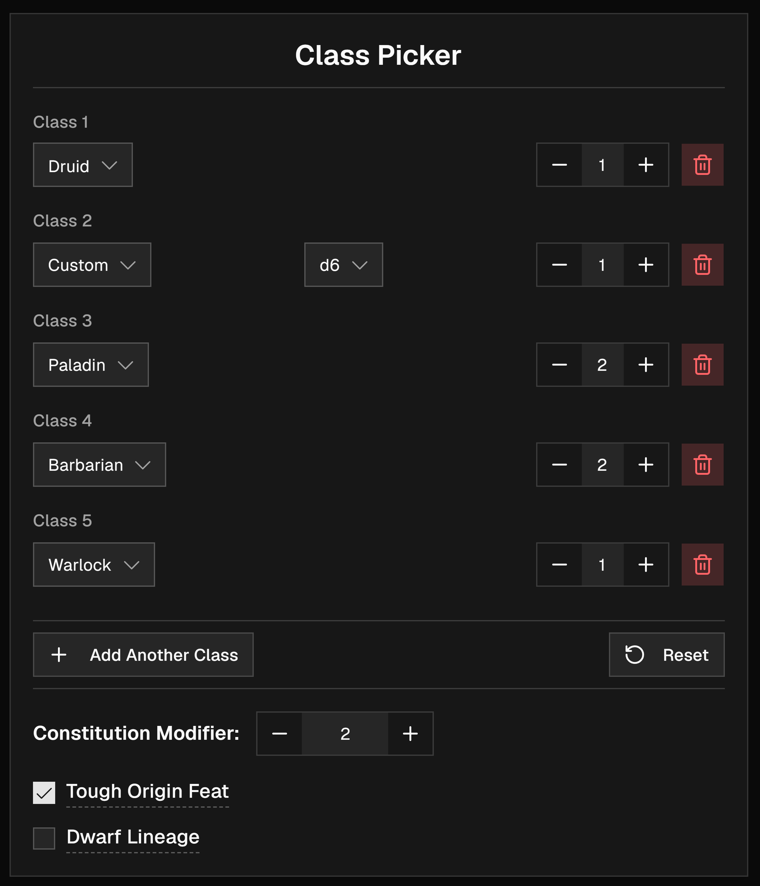|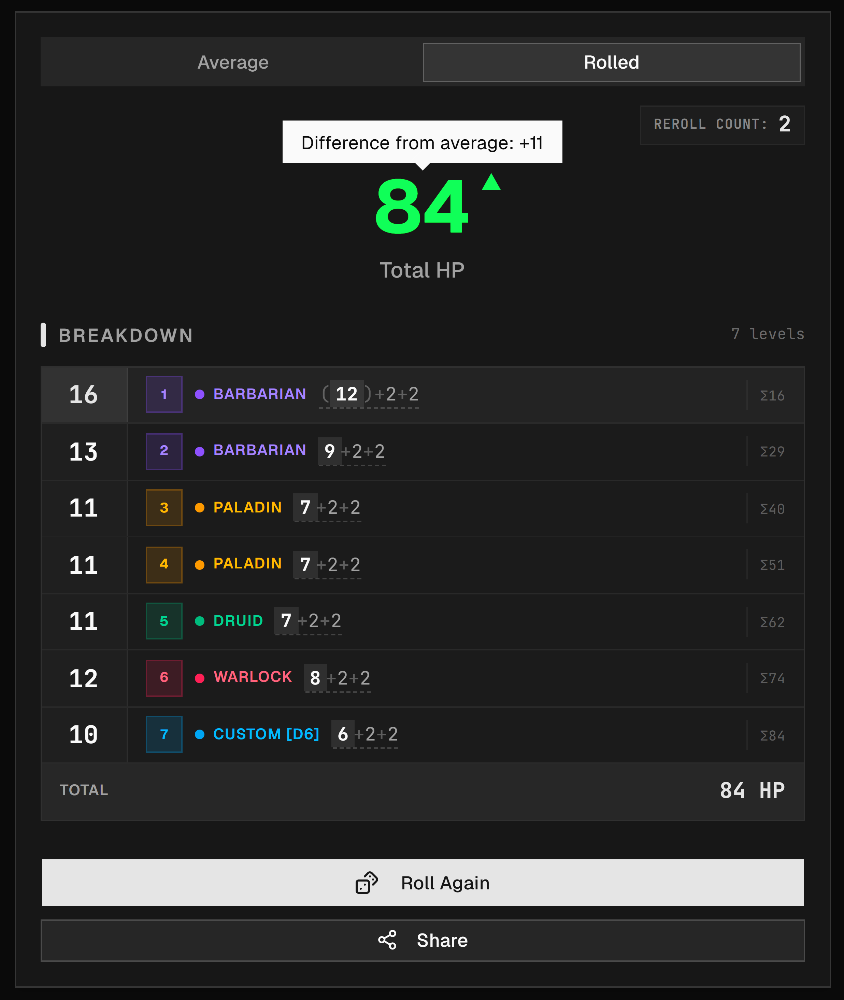 |
  

| **Class Picker** | **HP Breakdown** |
| :---: | :---: |
| Share Rolled HP via URL or QR Code. | Verification |
|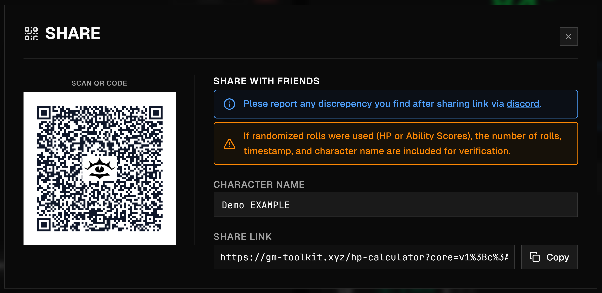| 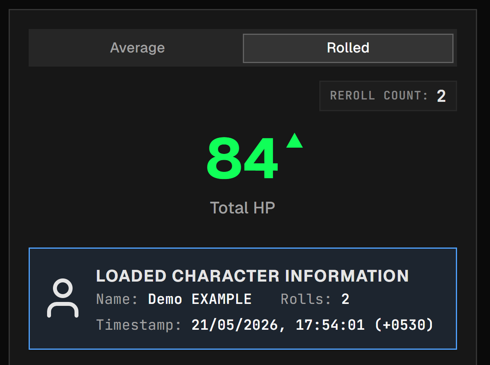 |

## Ability Scores

Generate balanced characters with real-time point tracking or use advanced rolling mechanics.

- Point buy with class & background section for suggested stat allocation.
    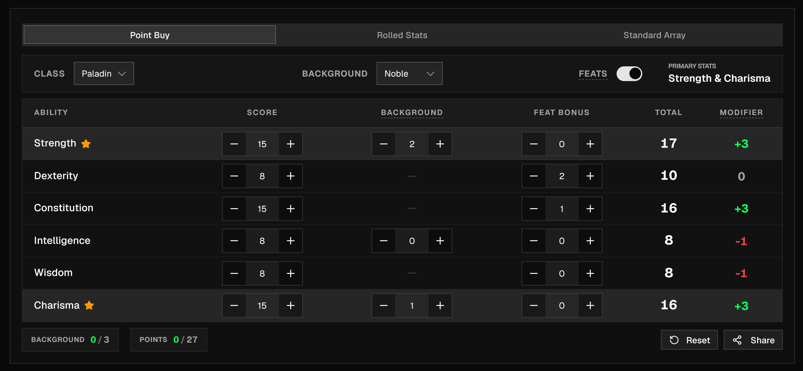

- Rolled Stats with suffled & manual score allocation options.

    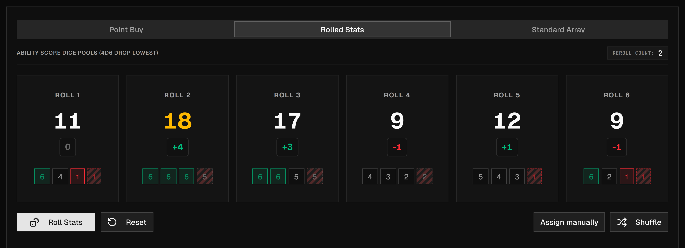

- Standard Array with PHB suggested points allocation based on class.

    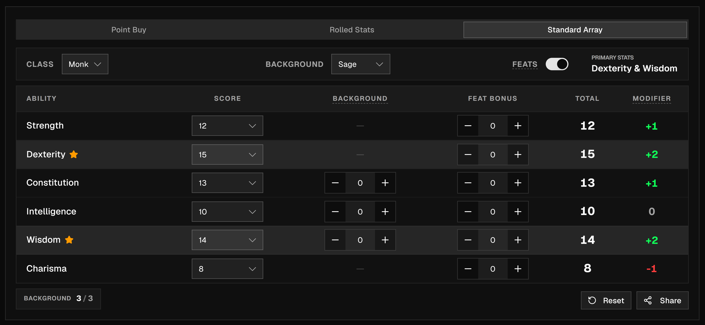

### Skills & Saving Throws

- Assign Skills & Saving throws proficiency or expertiese.

    

## DM Dice Roller

A specialized tool for DMs needing quick, high-density dice rolls. Features custom grouping, advantage/disadvantage toggles, and specific support for the Daggerheart RPG system.

- Preset rolls with groups for easy access to frequently used dice combinations or custom dice rolls for different creatures.
- Also supports rolling with advantage and disadvantage 
    
    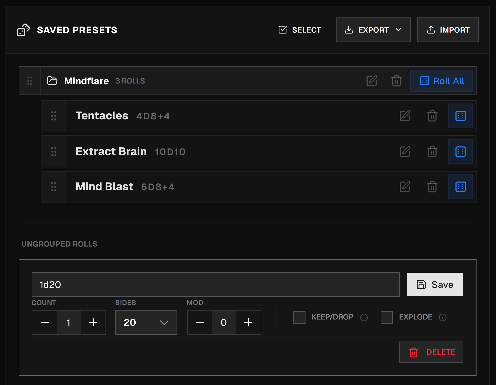
        
    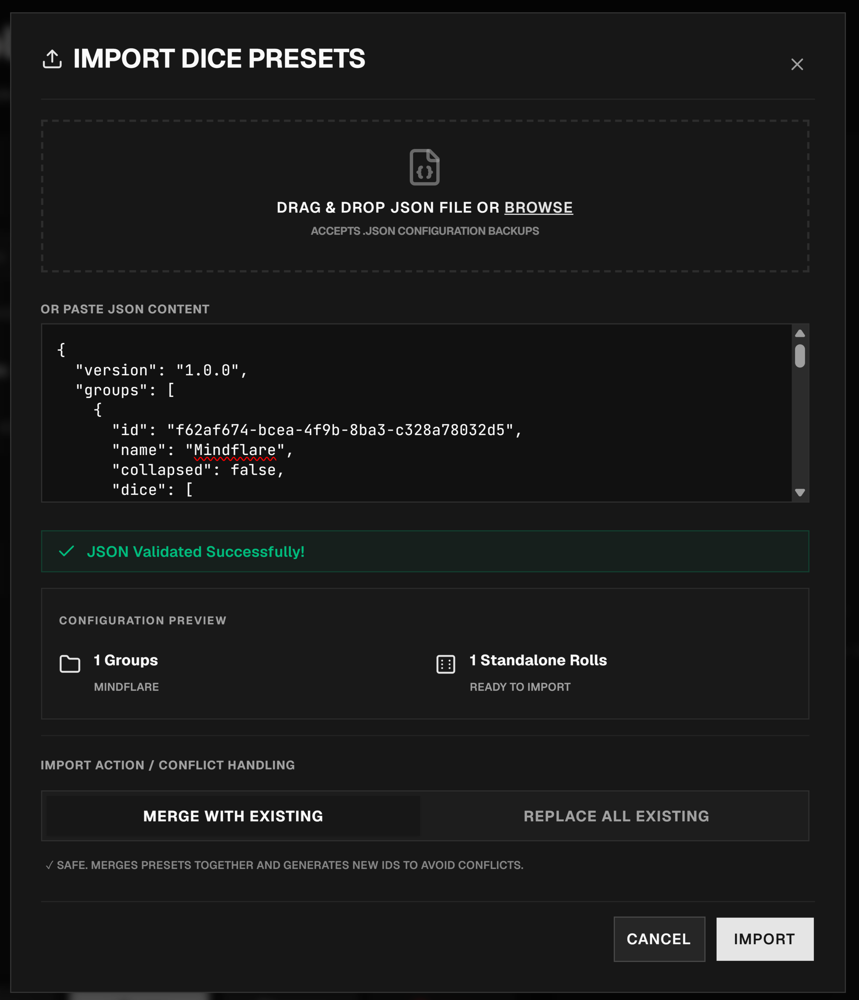

### Dice Roll History

| **Detailed** | **Compact** |
| :---: | :---: |
| 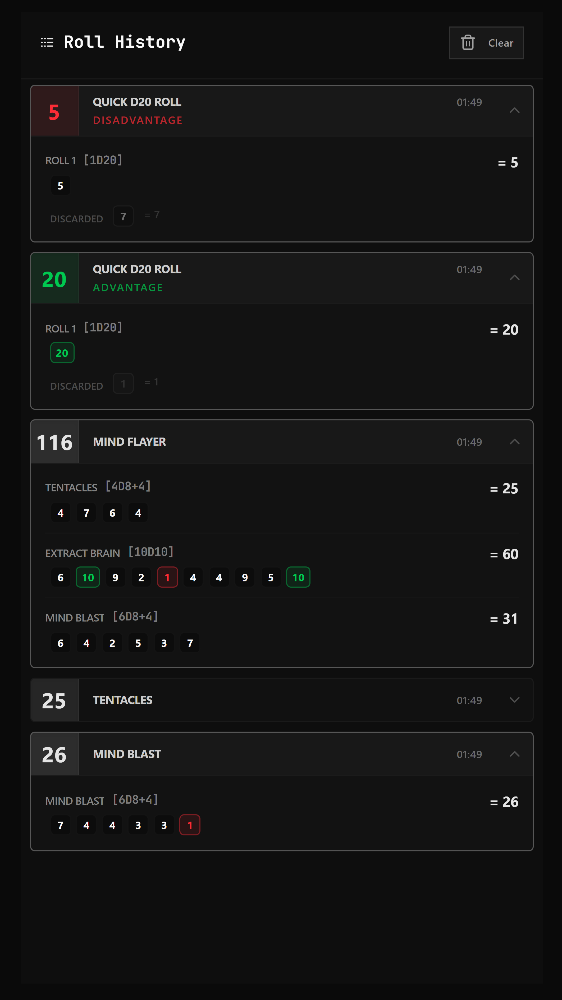 |  |

- Partial Support for Daggerheart, can be turned on in the settings, more comming soon!
    
    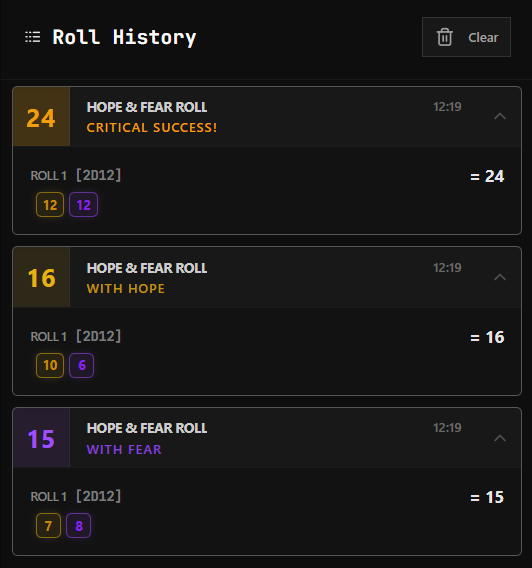

<!-- ## Future Enhancements

- Better Landing Page
- Serverside encrypted URLs for tamper-proof sharing. -->

## How to run locally

1. Make sure you have Node.js and Bun installed
1. Run `bun install` to install the dependencies
1. Run `bun run dev` to start the development server

## Contributions, Support, Feature Request & Bug Reports

Please join our [discord server](https://discord.gg/nBzSVyHfMy)