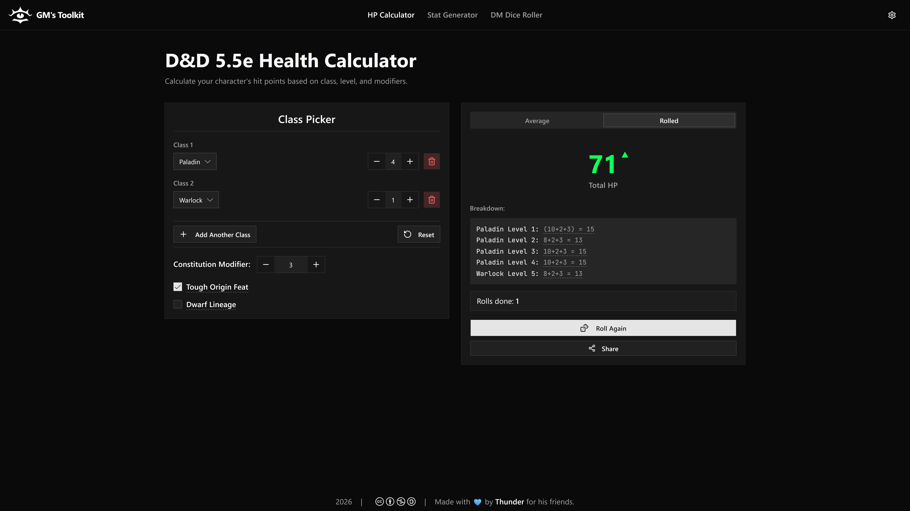
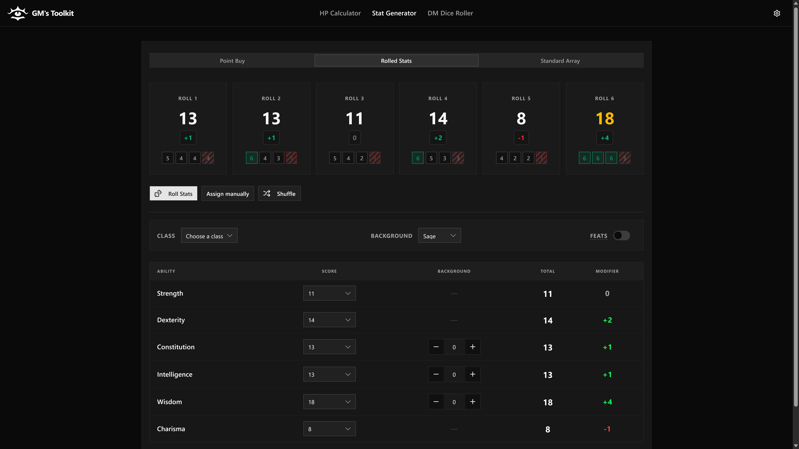
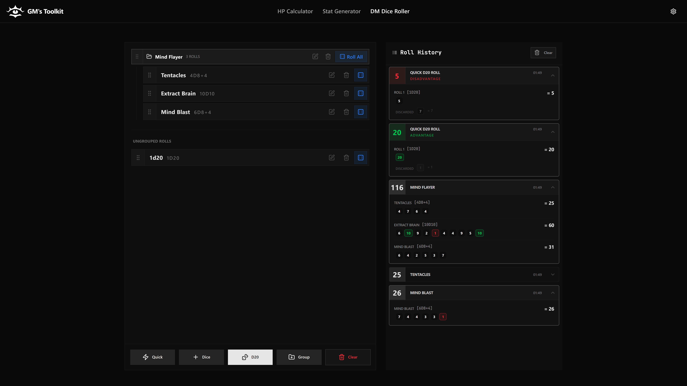
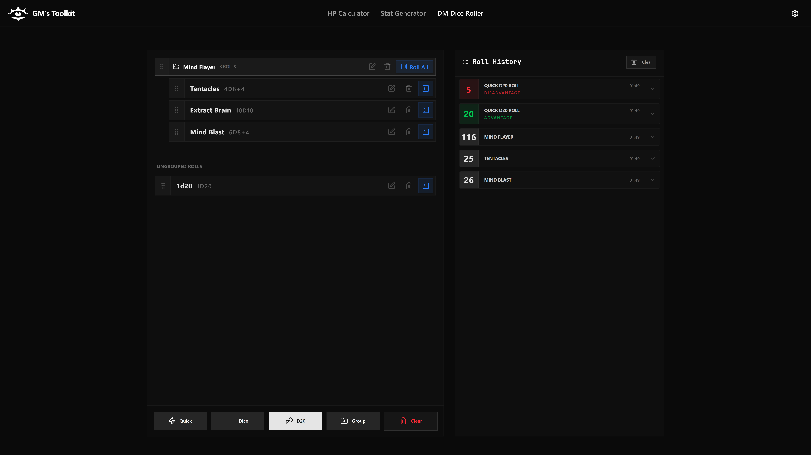
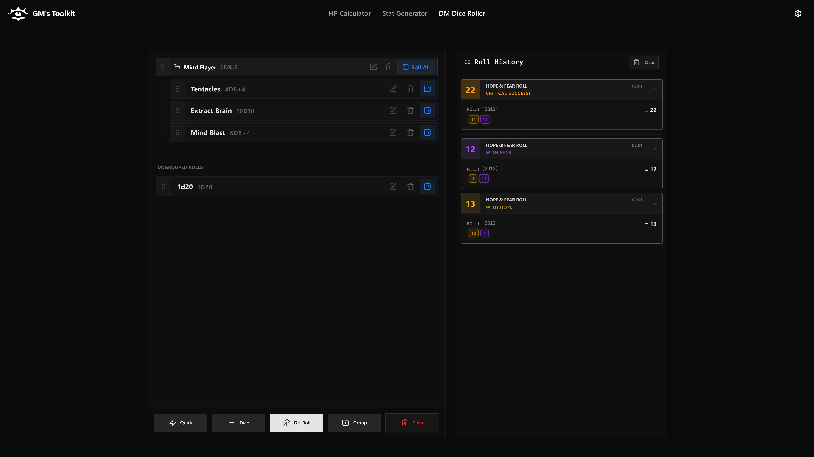

# GM's Toolkit

## About

GM's Toolkit is a powerful web application designed to streamline game management for Game Masters.

### Features
- **HP Calculator**: Track party HP, temporary HP, and status effects for the whole table.
- **Stat Generator**: Create characters with Point Buy, Standard Array, or advanced dice rolling logic.
- **Dice Roller**: High-density DM dice roller with custom groups and Daggerheart (2d12) support.

## Screenshots

### HP Calculator
Manage your party's health, temporary hit points, and death saves in one compact, efficient interface.

### Stat Generator
Generate balanced characters with real-time point tracking or use advanced rolling mechanics.

#### Point Buy

#### Rolled Stats

### DM Dice Roller
A specialized tool for DMs needing quick, high-density dice rolls. Features custom grouping, advantage/disadvantage toggles, and specific support for the Daggerheart RPG system.

#### Standard View

#### Compact View

#### Daggerheart Mode
