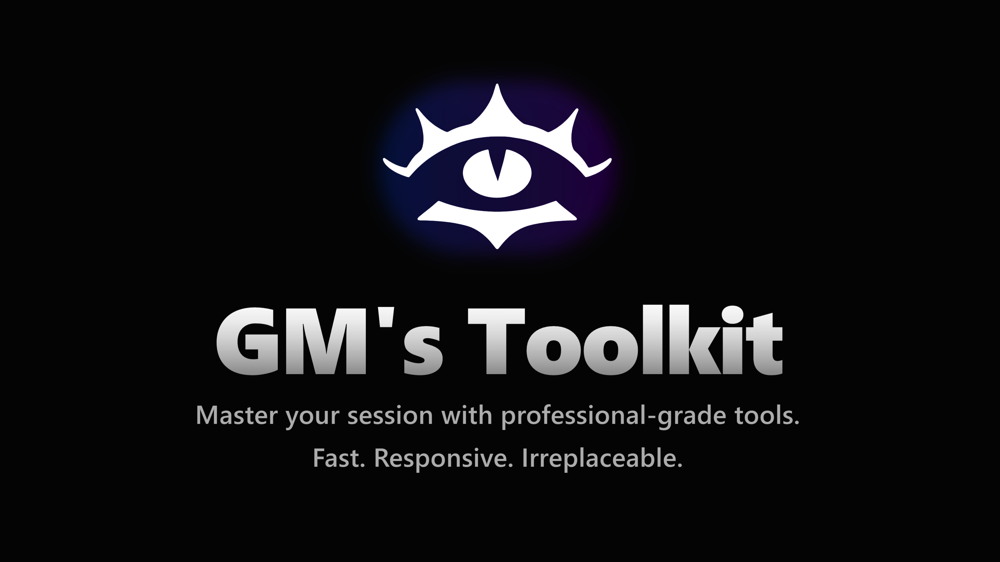

# GM's Toolkit

## About

GM's Toolkit is a powerful web application designed to streamline game management for Game Masters.

### Features
- **HP Calculator**: Track party HP, temporary HP, and status effects.
- **Stat Generator**: Generate character stats using various methods.
- **Dice Roller**: Advanced dice rolling with Daggerheart mode support.