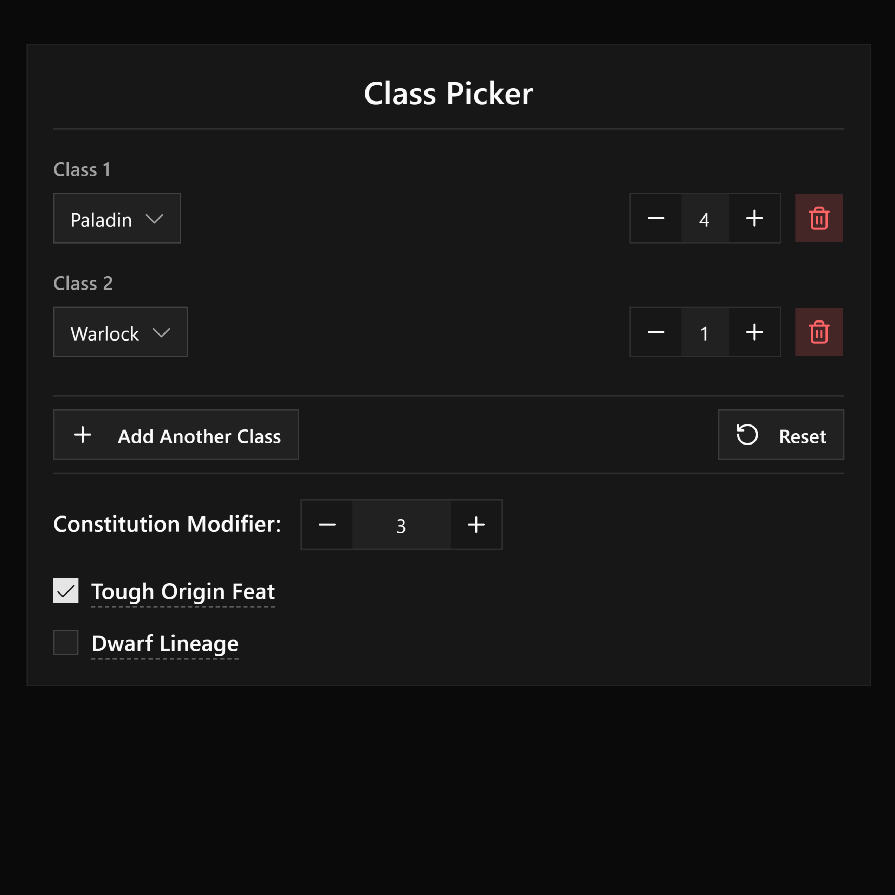
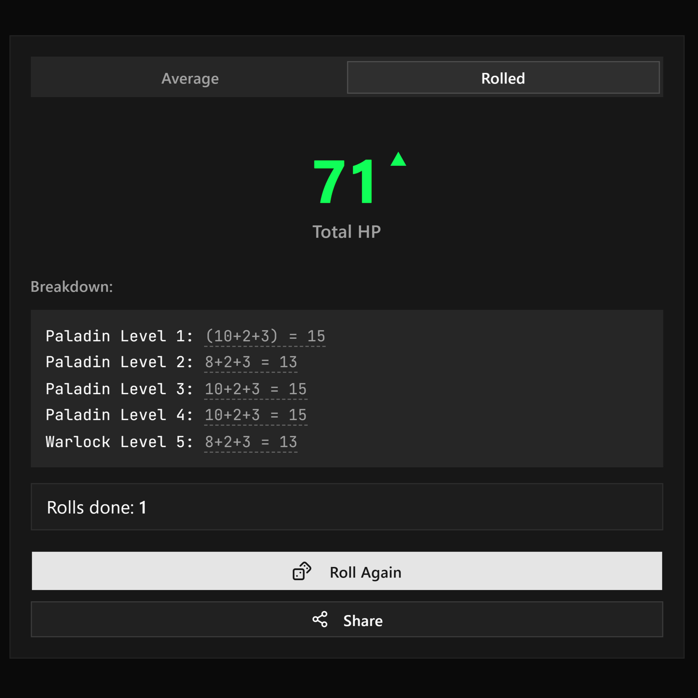
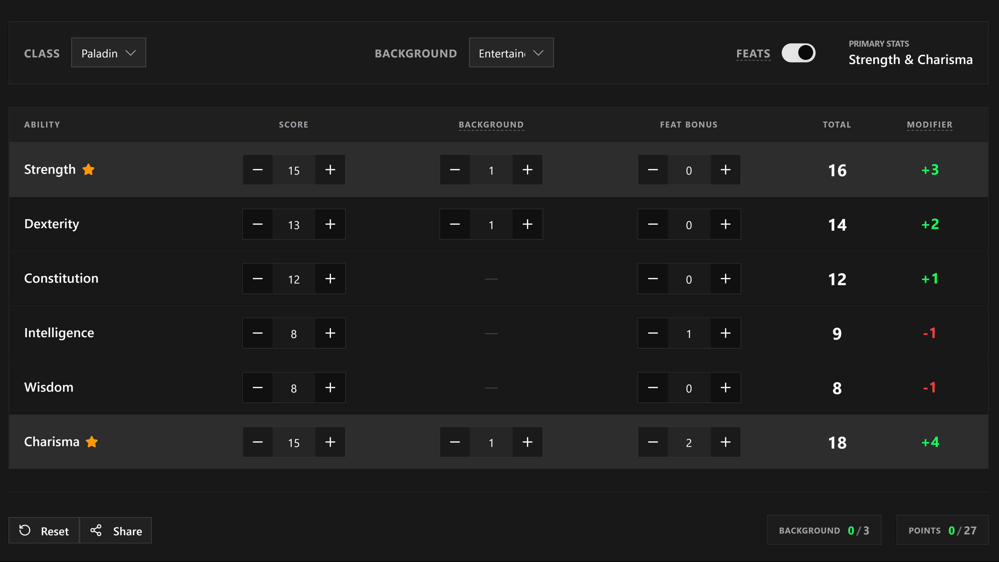
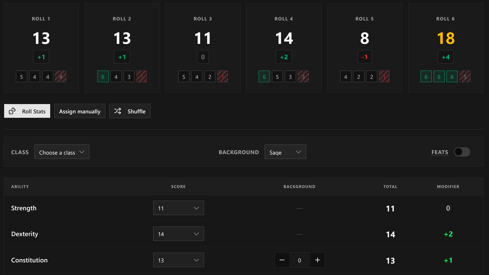
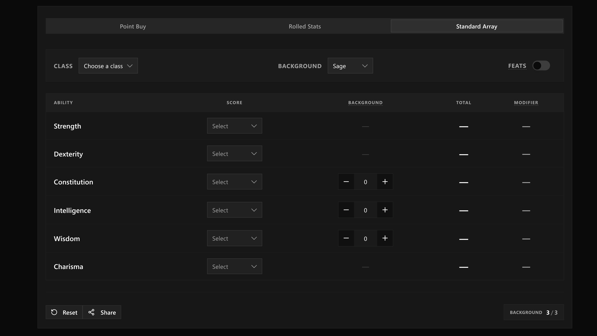
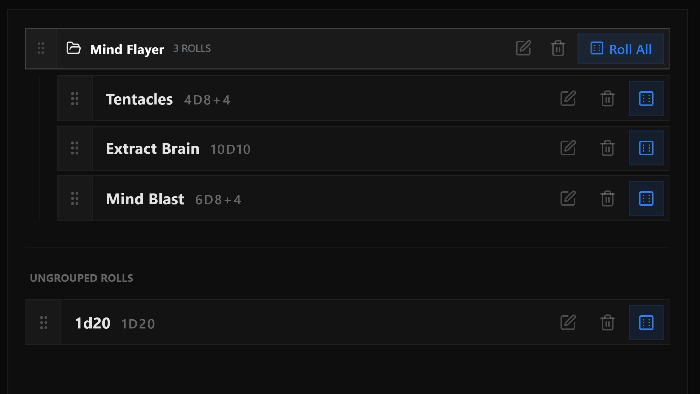
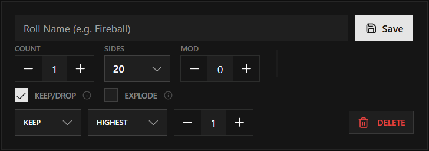
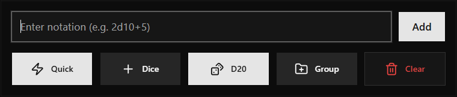
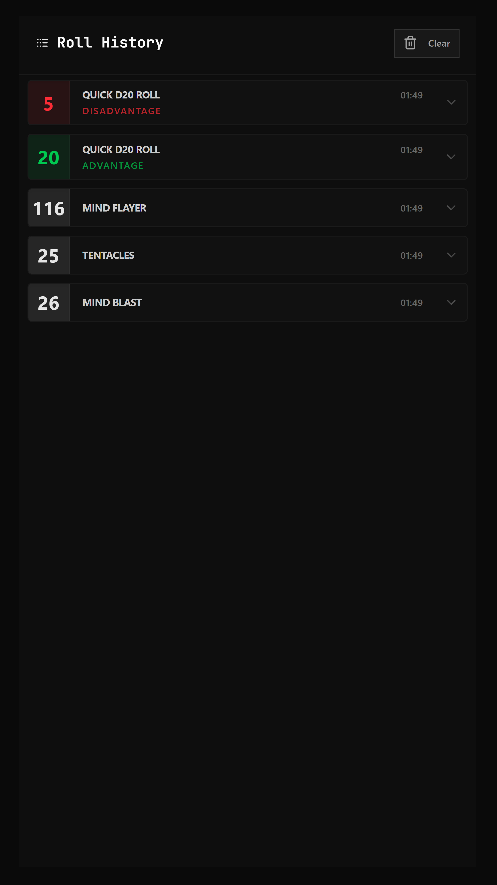

    <picture> 
        <source media="(prefers-color-scheme: dark)" srcset="./.github/branding/gm-toolkit-logo-white-glow.png" />
        <source media="(prefers-color-scheme: light)" srcset="./.github/branding/gm-toolkit-logo-black-glow.png" />
        
    </picture>
<h1>GM's Toolkit</h1>

GM's Toolkit is a powerful web application designed to streamline game management for Game Masters.

- **HP Calculator**: Calculate (or Roll) you character's HP with full multiclass support.
- **Stat Generator**: Alllocate (or Roll) you character's Ability Scores using Point Buy, Standard Array, or Dice Rolls.
- **Dice Roller**: A dice roller with support for presets, Groups and collective dice rolls. Also has partial Daggerheart's Hope & Fear (2d12) support.

<h2>Project Screenshots</h2>

## HP

Manage your party's health, temporary hit points, and death saves in one compact, efficient interface.

- HP Calculation with Multiclass support
    
    
- Rolled HP Results with differnce indicator against the average HP for the class combination
    
    

- Ability to share rolled stats with verifiable Name, No. of Rerolls, Time, and the dice roll results.

<!-- > Insert image of share modal -->
    
## Stat Generator
Generate balanced characters with real-time point tracking or use advanced rolling mechanics.

- Point buy with class & background section for suggested stat allocation.
    

- Rolled Stats with suffled & manual score allocation options.

    

- Standard Array with PHB Suggested Points Allocation based on class.

    

## DM Dice Roller

A specialized tool for DMs needing quick, high-density dice rolls. Features custom grouping, advantage/disadvantage toggles, and specific support for the Daggerheart RPG system.

- Preset Rolls with groups for easy access to frequently used dice combinations or custom dice rolls for different creatures.
- Also supports Rolling with advantage and disadvantage 

    
    
        

| **Detailed** | **Compact** |
| :---: | :---: |
|  |  |

- Partial Support for Daggerheart, can be turned on in the settings, more comming soon!
    
    

# Future Enhancements

- Share modal component, also display the time of rolled HP
- Encrypted URL for tamper-proof sharing.
- Share & Reset button, for Rolled Stats

